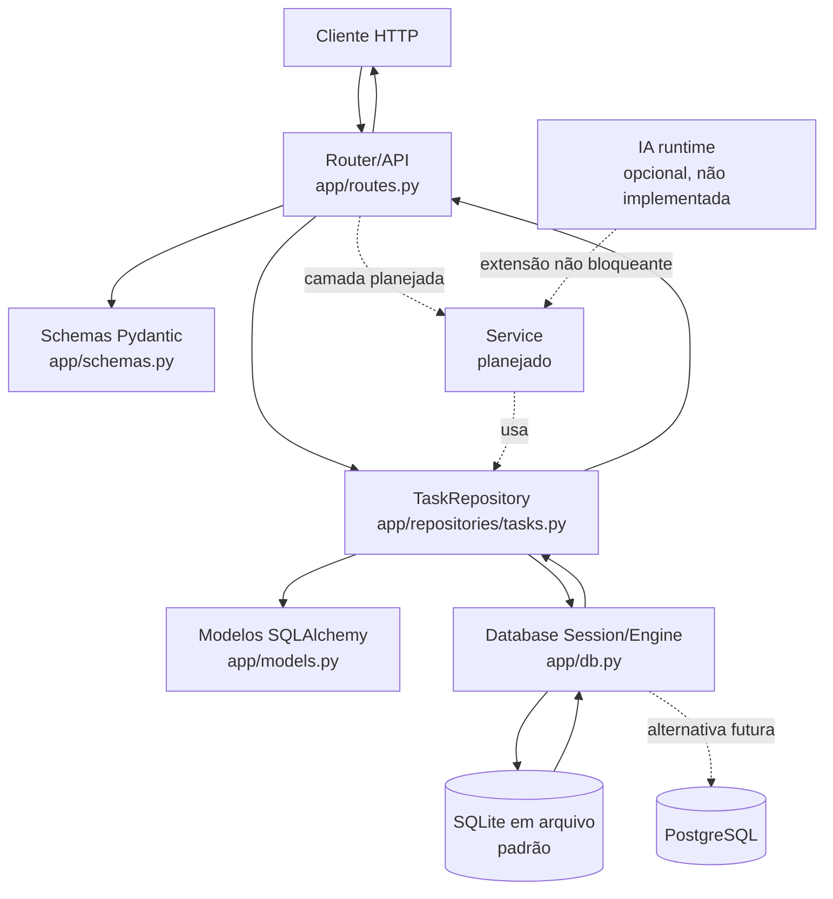

# Arquitetura — Micro-API de Gerenciamento de Tarefas

## Visão geral

O projeto é uma aplicação Python/FastAPI organizada para separar HTTP, validação, regras de uso e persistência. A estrutura atual já possui router/API, schemas Pydantic, modelos SQLAlchemy, banco/configuração e repository. Uma camada `service` ainda não existe no código e está documentada como evolução planejada, não como componente implementado.

A API principal funciona sem internet, chave de API ou provedor de IA.

## Responsabilidades por camada

| Camada | Localização atual | Responsabilidade |
| --- | --- | --- |
| Aplicação | `app/main.py` | Cria a aplicação FastAPI, registra rotas e inicializa tabelas no lifespan. |
| Router/API | `app/routes.py` | Recebe requisições HTTP, usa dependências FastAPI, aplica respostas e erros HTTP. |
| Schemas | `app/schemas.py` | Define validação e serialização Pydantic para criação, atualização e leitura. |
| Service | **Planejado** | Concentrará casos de uso e regras de negócio quando houver complexidade que justifique a camada. |
| Repository | `app/repositories/tasks.py` | Encapsula consultas, inserções, atualizações e exclusões de tarefas. |
| Modelos | `app/models.py` | Define `Task` e `TaskStatus` para o mapeamento SQLAlchemy. |
| Banco/configuração | `app/db.py` | Configura engine e sessões, fornece dependência de banco e cria tabelas. |
| Banco relacional | SQLite por padrão | Persiste os dados em arquivo. PostgreSQL é alternativa futura quando houver justificativa e driver compatível. |
| IA | **Opcional e não implementada** | Um componente como `PriorityAdvisor` poderá apoiar funcionalidades adicionais, sem bloquear o CRUD. |

## Dependências permitidas

A direção preferencial das dependências é:

```text
API/router -> service -> repository -> modelos/db -> SQLite ou PostgreSQL
API/router -> schemas Pydantic
service -> schemas/domínio, quando necessário
IA opcional -> service, somente como extensão não bloqueante
```

Regras:

- `routes.py` pode depender de FastAPI, schemas e da composição de dependências.
- A camada de service, quando criada, não deve depender de objetos HTTP, `HTTPException` ou detalhes de FastAPI.
- O service deve chamar repositories para persistência, e não executar SQLAlchemy diretamente.
- O repository pode depender de `Session` do SQLAlchemy e dos modelos persistentes.
- Modelos não devem depender de routers ou schemas HTTP.
- Schemas não devem acessar o banco diretamente.
- A integração de IA, se criada, deve ser opcional, isolada e possuir caminho local determinístico ou fallback que mantenha a API principal funcionando.

### Estado atual versus arquitetura-alvo

Hoje, o router chama `TaskRepository` diretamente porque o domínio do MVP ainda é pequeno. A separação de um service é planejada apenas quando regras de negócio crescerem; sua ausência atual não deve ser tratada como componente implementado.

## Fluxo principal de dados

1. O cliente envia uma requisição HTTP para uma rota de tarefas.
2. FastAPI encontra o endpoint no router e valida o payload ou os parâmetros com Pydantic e tipos declarados.
3. No estado atual, o router cria `TaskRepository` com a sessão fornecida por `app.db` e executa o caso de persistência.
4. O repository usa SQLAlchemy para consultar ou alterar o modelo `Task`.
5. SQLAlchemy grava ou lê dados no SQLite em arquivo, configurado por `DATABASE_URL`; PostgreSQL é uma alternativa futura.
6. O resultado volta ao router e é serializado pelo schema de resposta `TaskRead`.
7. FastAPI retorna o status HTTP e o JSON ao cliente.

Em uma evolução com service, o passo 3 passará pelo service, mantendo o router livre de regras de negócio e o repository livre de decisões HTTP.

## Diagrama



As linhas contínuas representam o fluxo implementado atualmente. As linhas tracejadas representam componentes ou caminhos planejados, opcionais ou futuros.

## Limites do MVP

A arquitetura cobre CRUD, conclusão, filtro por status, validação Pydantic e persistência real com SQLAlchemy + SQLite. Não há integração obrigatória de LLM, autenticação, paginação ou uma camada service implementada; esses itens não podem substituir o núcleo obrigatório.
